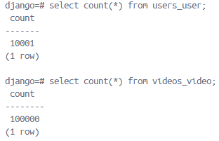

```shell
python manage.py runscript fake_data --script-args timeit 
python manage.py runscript fake_data --script-args timeit users=10 videos=20
python manage.py runscript fake_data --script-args timeit commit

python manage.py makemigrations
python manage.py migrate
python manage.py createsuperuser
python manage.py runserver
```

### Создание фейковых пользователей и видео

```shell
python manage.py runscript fake_data --script-args timeit users=10000 videos=100000 commit
[2026-04-13 17:10:28] [scripts.fake_data] [INFO]: Data WILL be commited
[2026-04-13 17:10:28] [scripts.fake_data] [INFO]: Users count = 10000
[2026-04-13 17:10:28] [scripts.fake_data] [INFO]: Videos count = 100000
[2026-04-13 17:10:28] [scripts.fake_data] [INFO]: Deleting rows from User
[2026-04-13 17:10:28] [scripts.fake_data] [INFO]: Done
[2026-04-13 17:10:28] [scripts.fake_data] [INFO]: Created 1000 / 10000 fake objects
[2026-04-13 17:10:28] [scripts.fake_data] [INFO]: Created 2000 / 10000 fake objects
...
[2026-04-13 17:10:28] [scripts.fake_data] [INFO]: Created 10000 / 10000 fake objects
[2026-04-13 17:10:28] [scripts.fake_data] [INFO]: Created 1000 / 100000 fake objects
[2026-04-13 17:10:28] [scripts.fake_data] [INFO]: Created 2000 / 100000 fake objects
...
[2026-04-13 17:10:32] [scripts.fake_data] [INFO]: Created 100000 / 100000 fake objects
[2026-04-13 17:10:36] [scripts.fake_data] [INFO]: Execution time = 8.066144599999916
```

